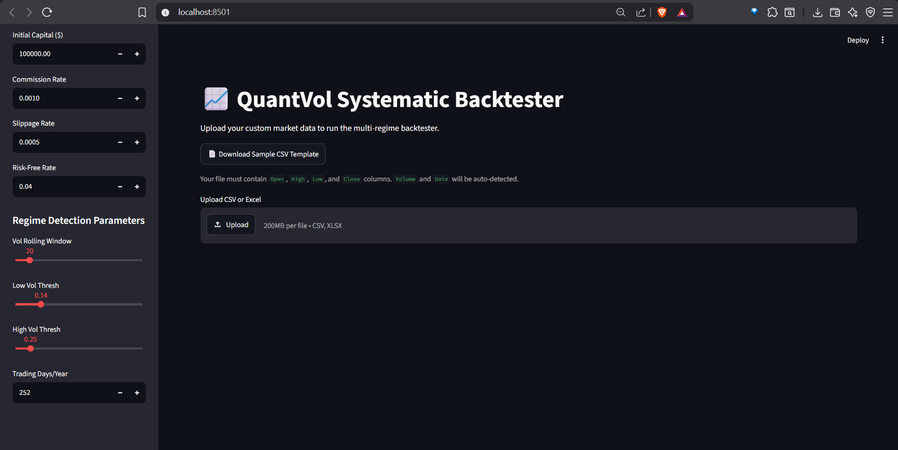

# QuantVol Framework
**Adaptive Regime-Aware Systematic Backtesting Engine**


> *Interactive Streamlit web dashboard for dynamic, regime-aware backtesting.*

## Overview
Hi, this is a fully vectorized, rules-based systematic backtesting framework. It is designed to evaluate trading strategies across multiple asset classes (Crypto, Equities, Gold) without relying on leverage. 

The core logic dynamically adjusts position sizing based on real-time market volatility regimes (low, medium, high). All hardcoded values have been removed—everything is driven by a central `CONFIG` dictionary.

## Key Features
* **100% Dynamic Config:** No magic numbers in the code. Timeframes, thresholds, capital, and friction are handled centrally.
* **Vectorized Execution:** Uses `pandas` and `numpy` for fast calculations. No slow `for` loops over rows.
* **Volatility Regime Detection:** Uses rolling standard deviation to classify market states. Strategies automatically flatten out during high-volatility storms.
* **Stress Testing Suite:** In-built simulators for flash crashes, volatility spikes, and transaction cost surges.
* **Custom Data Loader:** Includes `load_csv_data` utility so you can plug in real market data (Binance, Yahoo Finance, etc.) easily.
* **Interactive Web Dashboard:** Includes a Streamlit frontend (`app.py`) for uploading custom datasets, tweaking parameters dynamically via sliders, and visualizing regime-adjusted equity curves instantly.

## Tech Stack
* Python 3.10+
* Pandas & Numpy (Core computation)
* Matplotlib (Headless plotting for equity curves)
* Unittest (For validating math and logic)

## Project Structure
```text
QP/
│-- backtester.py      # Core execution engine with frictional costs
│-- strategies.py      # Base class and strategy implementations (MA Crossover, Vol Target)
│-- utils.py           # Helpers for data loading, regime detection, and performance metrics
│-- run_backtest.py    # Main runner script with master CONFIG block
│-- requirements.txt   # Dependencies
│-- tests/             # Unit tests for core functions
```

## Setup & Execution
1. Install dependencies:
   ```bash
   pip install -r requirements.txt
   ```
2. Run unit tests to verify logic:
   ```bash
   python -m unittest discover tests/
   ```
3. Execute the backtest pipeline:
   ```bash
   python run_backtest.py
   ```
   *Note: This will generate an `equity_curve.png` plot and save execution details to `backtest.log`.*

### Docker Execution (Optional)
To run in an isolated production-like container without installing Python locally:
```bash
docker build -t quantvol-backtester .
docker run --rm -v $(pwd):/app quantvol-backtester
```

### Web Dashboard (Streamlit)
To launch the interactive frontend for drag-and-drop CSV backtesting:
```bash
streamlit run app.py
```
*(If your PATH is unconfigured, use `python -m streamlit run app.py`)*

## Custom Data Usage
If you want to run this on your own data, fetch a CSV and modify `run_backtest.py`:
```python
from utils import load_csv_data
data = load_csv_data("your_file.csv")
```
Make sure to adjust the `trading_days` in the `CONFIG` (e.g., 365 for Crypto, 252 for Stocks).
